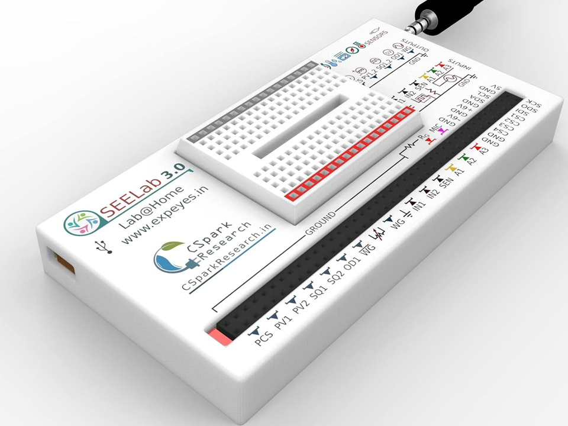

# Thermocouple Sensitivity Measurement using ExpEYES and ADS1115

## Overview
This project aims to measure the sensitivity of a thermocouple by analyzing thermo-emf as a function of temperature using ExpEYES, an ADS1115 analog-to-digital converter, and a PT1000 temperature sensor.

Download the "ET_Curve.exe" file and run directly.



## Required Apparatus :

1. ExpEYES latest model (SEELAB 3.0, with I2C expansion bus)
2. Analog to digital converter (ADS1115)
3. Temperature Sensor (PT1000)
4. T/K-type thermocouple 
5. Jumper wires (with alligator clips, optional)
6. Glass beaker (100 ml)
6. Mini Immersion water heater (optional)

# Procedure:

### Experimental Setup

1. **Preparation**: Take 40 ml of hot water (~90°C).
2. **Sensor Setup**: Submerge PT1000 and T/K-type thermocouple in hot water.
3. **Connections**:
   - Connect PT1000 between SEN and Ground.
   - Connect ExpEYES (VCC, GND, SCL, SDA) to ADS1115 (VCC, GND, SCL, SDA).
   - Connect thermocouple between A0 of ADS1115 and ground. 
4. **Data Acquisition**:
   - Connect ExpEYES to PC via USB.
   - Run the provided ET_Curve.exe file.
   - Set time interval (20 or 30 sec).
   - Data (time, temperature, thermo-emf) will be saved to "ET.dat".
5. **Graphing**:
   - Plot 2nd and 3rd column
   - Fit Linear to estimate the thermocouple sensitivity (slope) and room temperature (extrapolation)

> ### NOTES :
> - Don't forget to delete the existing data file "ET.dat", if you are running the ET_Curve.exe file multiple times.
> - Reference_data (i.e, "T-type.dat") and graph ("ET Curve.png") for T-type thermocouple are provided.

## Experimental Setup and Connections :


> ## NOTES :
> - A sample data ('T-type.dat') and the corresponding graph ('ET Curve.png') for the t-type thermocouple are also provided for reference.
> - Please see the 'Experimental Setup.jpeg' and 'Connections for ET Curve.jpeg' images for setup and connection.

#Result :

## T-type.dat :
```plaintext
0.06 58.80 1.85
20.15 76.35 1.94
40.27 74.75 1.81
60.41 72.20 1.70
80.61 70.20 1.59
100.72 68.21 1.49
120.90 66.09 1.40
141.07 64.39 1.32
161.22 62.38 1.24
181.41 61.18 1.17
201.58 59.83 1.11
221.72 58.33 1.04
241.83 57.61 0.98
261.96 56.24 0.93
282.15 55.24 0.88
302.35 54.46 0.84
322.48 53.35 0.78
342.66 52.32 0.73
362.86 51.36 0.69
383.06 50.55 0.65
403.26 49.84 0.62
423.49 48.82 0.59
443.65 48.30 0.54
463.80 47.83 0.52
483.95 47.03 0.48
504.10 45.86 0.45
```

## Obtained ET Curve from "T-type.dat" :


## Special thanks to:

- Heartfelt thanks to Dr. Jithin B.P. from CSpark Research for his invaluable assistance and support. His expertise and guidance were instrumental in the successful completion of this project. Dr. Jithin, your unwavering help and dedication are deeply appreciated.

- Wholehearted thanks to the entire Inter-University Accelerator Centre (IUAC), New Delhi, India team especially Er. V.V.V. Satyanarayana, Mr. Abhijit Sarkar, and Dr. Ajith Kumar B. P. for developing the device and conducting the training program.

- Warm appreciation to Mr. Hemanta Kumar Ghosh from the Department of Basic Science, NSHM Knowledge Campus, Durgapur for his unwavering support in making this project successful. 

## License
This work is licensed under a [Creative Commons Attribution 4.0 International License](https://creativecommons.org/licenses/by/4.0/).


## Author
  - Dr. Ujjwal Ghanta

Thanks
